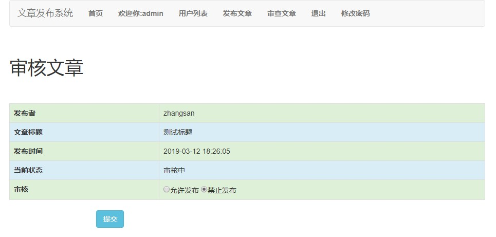

## 文章发布管理系统

*使用 Spring Boot、MySQL、MyBatis、Thymeleaf、Bootstrap 完成系统的开发。*

系统有管理员和普通用户两个角色。

管理员可以管理用户和文章、审核文章。登录的用户可以发布文章、管理自己的文章、评论审核通过的文章。

## 界面展示

#### 首页

首页分页显示已经审核通告的所有文章

#### 登录页面

#### 用户列表界面

管理员可以查看系统内所有的用户

-- ------------------

审核用户

--------------------------

管理用户的文章

#### 文章详情页

